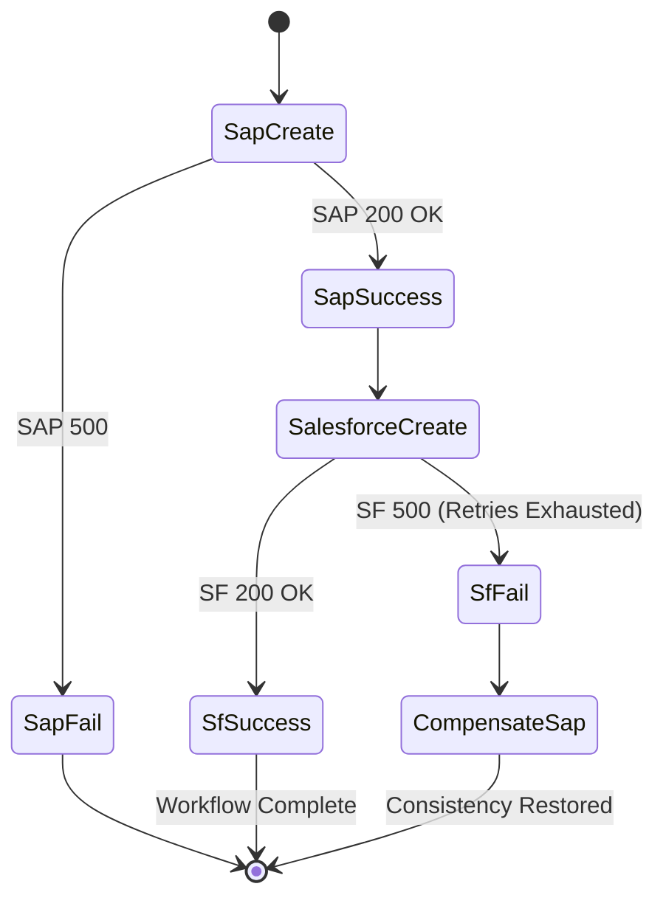

<ADR-011: Saga/Compensation Strategy — SAP + Salesforce Partial Failure>
**Status:** Accepted  
**Date:** 2026-10-01  
**Deciders:** Principal Engineering Team

## Context
When a contract is approved, the system must often synchronize this state to external enterprise systems, specifically creating a contract record in SAP and an opportunity in Salesforce. These are separate external systems; we cannot use a single distributed transaction (2PC). If the SAP write succeeds but the Salesforce write fails (transiently or permanently), the system is left in an inconsistent state. We need a reliable strategy to handle partial failures, retries, and eventual consistency without leaving zombie records.

## Decision
We will implement a choreography-based saga with compensating transactions to manage distributed state across SAP and Salesforce.

**Saga Steps:**
1. `SapCreateContract` action runs.
   - On success: Publishes `SapContractCreated` event.
   - On failure: Publishes `SapContractFailed` event (workflow halts, alerts user).
2. `SalesforceCreateOpportunity` action triggers by listening to `SapContractCreated`.
   - On success: Publishes `SalesforceOpportunityCreated` event (workflow completes).
   - On failure (after retries exhausted): Publishes `SalesforceOpportunityFailed` event.
3. **Compensation:** The SAP integration listens for `SalesforceOpportunityFailed`. Upon receiving it, it publishes a `CompensateSapContract` command, which invokes the `SapCancelContract` adapter to logically delete/cancel the previously created SAP record.

**Idempotency:**
Every step must be idempotent. We use the pattern: `idempotency_key = {workflow_run_id}:{step_name}`. The integration adapters check a fast cache/database for this key before executing. If the key exists, it returns the cached success result without calling the external API.



## Alternatives Considered
- **Distributed 2-Phase Commit (2PC):** Rejected. SAP and Salesforce REST APIs do not support 2PC/XA transactions.
- **Optimistic 2-phase commit:** Rejected. Unreliable over HTTP.
- **Manual reconciliation job:** Rejected. Shifts the burden to operations/support teams and leaves the system inconsistent for too long.
- **Orchestration-based Saga:** Rejected (for now). Choreography using our existing Service Bus keeps components decoupled, though it is slightly harder to trace visually without specialized tooling.

## Consequences
### Positive
- System remains eventually consistent even in the face of partial failures.
- No distributed locks or long-running blocking transactions.
- Integrations remain decoupled.

### Negative
- Increased complexity; requires implementing "undo" operations for every "do" operation.
- Requires careful handling of idempotency.
- State is temporarily inconsistent while compensation runs.

## Failure Modes and Mitigations
1. **Compensation itself fails:** The `SapCancelContract` call fails after Salesforce failed. *Mitigation:* The compensation command is placed on a durable retry queue. If it fails permanently, it goes to a Dead Letter Queue (DLQ) which alerts operations for manual intervention.
2. **Message bus goes down between step 1 and step 2:** *Mitigation:* The Outbox pattern ensures the `SapContractCreated` event is durably stored in the database. When the bus recovers, the publisher will send the event.
3. **Same approval replayed after original completion:** *Mitigation:* Strict idempotency checks using `{workflow_run_id}:{step_name}` prevent the SAP and Salesforce adapters from creating duplicate records.
4. **Salesforce succeeds on retry but compensation already ran:** A transient network error caused a timeout, but SF actually processed the request. We initiate compensation, cancelling SAP, but SF has the record. *Mitigation:* Salesforce creates must be idempotent on their side (using our `idempotency_key` as an external ID). If we time out and compensate, we must also send a compensation command to Salesforce to cancel the potentially created opportunity.

## Implementation Notes
Implement strict idempotency checking in integration handlers.

```csharp
public async Task Handle(CompensateSapContractCommand command)
{
    var idempotencyKey = $"{command.WorkflowRunId}:sap_cancel";
    if (await _idempotencyService.HasExecutedAsync(idempotencyKey)) return;
    
    await _sapAdapter.CancelContractAsync(command.ContractId);
    await _idempotencyService.MarkExecutedAsync(idempotencyKey);
}
```
</ADR-011: Saga/Compensation Strategy — SAP + Salesforce Partial Failure>
